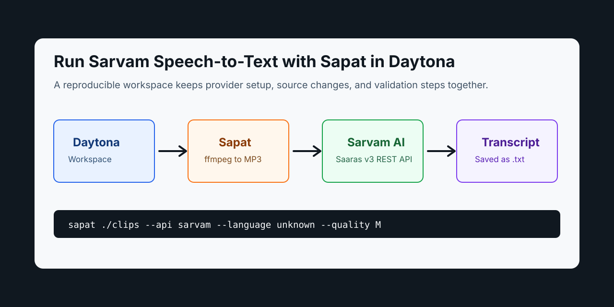

# Run Sarvam Transcription With Sapat

# Introduction

Speech-to-text workflows are easy to demo and hard to keep tidy. A developer
records a product walkthrough, a team meeting, or a customer interview, uploads
the audio to a provider, copies the transcript into a document, and then repeats
the same steps with slightly different environment variables the next week.

[Daytona](https://www.daytona.io/) helps by turning that workflow into a
reproducible workspace. In this guide, you will use Daytona with
[Sapat](https://github.com/nibzard/sapat), a Python command-line tool that
converts video files to MP3 and writes transcripts beside the source files. The
workflow uses a companion Sapat change that adds a Sarvam AI
[speech-to-text provider](../definitions/20260521_definition_speech-to-text_provider.md)
through `--api sarvam`.



Sarvam AI is a strong fit when your recordings include Indian languages,
English, or code-mixed speech. Its current speech-to-text REST API accepts a
multipart audio file, authenticates with `api-subscription-key`, and returns a
JSON response containing fields such as `transcript`, `language_code`, and
optional timestamp or diarization data. Sarvam's current docs recommend
`saaras:v3` for new integrations and describe output modes including
`transcribe`, `translate`, `verbatim`, `translit`, and `codemix`.

## TL;DR

- Create a Daytona workspace for the Sapat repo.
- Add the Sarvam provider branch and install Sapat locally.
- Put only local, uncommitted environment variables in `.env`.
- Run `sapat` with `--api sarvam` against a short recording or a folder of MP4 files.
- Validate the `.txt` transcript, language detection, and failure paths before using it in a production workflow.

## What You Will Build

You will set up a repeatable transcription workspace with this shape:

| Layer | Responsibility |
| --- | --- |
| Daytona workspace | Keeps Python, ffmpeg, source code, and validation commands in one reproducible environment. |
| Sapat CLI | Converts input video to MP3, selects the provider, sends audio, and writes the transcript. |
| Sarvam provider | Sends multipart audio to Sarvam's `/speech-to-text` endpoint and maps `transcript` to Sapat's text writer. |
| Transcript review | Checks language detection, mode choice, and output quality before sharing the transcript. |

The companion implementation PR is
[`nibzard/sapat#37`](https://github.com/nibzard/sapat/pull/37). It adds a
`SarvamTranscription` class, wires `--api sarvam` into Sapat's Click command,
documents the `.env` settings, and includes mocked tests for request construction
and CLI routing.

## Prerequisites

You need:

- A working [Daytona](https://www.daytona.io/docs/installation/installation/) installation.
- GitHub access so Daytona can create a workspace from a repository.
- Python 3.9 or newer inside the workspace.
- `ffmpeg`, because Sapat converts video files to MP3 before transcription.
- A Sarvam AI API key from the Sarvam dashboard.
- A short MP4, WAV, or MP3 sample recording for validation.

Keep secrets out of Git. The examples below use environment variable names and
placeholder values only. Do not commit a real `.env` file.

## Create a Daytona Workspace

Start Daytona locally:

```bash
daytona server
```

Create a workspace from the Sapat fork that contains the Sarvam provider branch:

```bash
daytona create https://github.com/SadmanPinon/sapat --code
```

Open the workspace terminal and switch to the implementation branch:

```bash
git fetch origin add-sarvam-transcription-provider
git checkout add-sarvam-transcription-provider
```

Install the Python package in the workspace:

```bash
python -m pip install .
```

Confirm the CLI exposes the Sarvam option:

```bash
sapat --help
```

You should see `sarvam` in the `--api` choices:

```text
--api [openai|groq|azure|sarvam]
```

## Configure Sarvam Safely

Create a local `.env` file from the example:

```bash
cp .env.example .env
```

Add your Sarvam settings:

```bash
SARVAM_API_KEY=your_sarvam_api_key_here
SARVAM_STT_ENDPOINT=https://api.sarvam.ai/speech-to-text
SARVAM_STT_MODEL=saaras:v3
SARVAM_STT_MODE=transcribe
SARVAM_LANGUAGE_CODE=
```

The provider reads these values:

- `SARVAM_API_KEY`: Required. Sent as the `api-subscription-key` header.
- `SARVAM_STT_ENDPOINT`: Optional. Defaults to `https://api.sarvam.ai/speech-to-text`.
- `SARVAM_STT_MODEL`: Optional. Defaults to `saaras:v3`.
- `SARVAM_STT_MODE`: Optional. Defaults to `transcribe`.
- `SARVAM_LANGUAGE_CODE`: Optional. Leave blank to choose per run, use `unknown` for detection, or set a BCP-47 code such as `hi-IN`, `ta-IN`, or `en-IN` as a fallback.

Sapat also maps common short language codes. For example, `--language hi`
becomes `hi-IN`, `--language ta` becomes `ta-IN`, and `--language en` becomes
`en-IN`.

## Run Your First Sarvam Transcript

Create a folder for local samples:

```bash
mkdir -p clips
```

Copy a short test recording into that folder. For the REST flow, start with a
short clip so you can validate credentials, file handling, and language
detection quickly. Sarvam also documents batch and streaming APIs for longer or
real-time workflows, but this Sapat provider is intentionally scoped to the
simple REST endpoint.

Run Sapat on one file:

```bash
sapat clips/demo.mp4 --api sarvam --language unknown --quality M
```

Or run it over every `.mp4` file in the folder:

```bash
sapat clips --api sarvam --language unknown --quality M
```

Sapat will:

1. Convert each MP4 file to a temporary MP3 with `ffmpeg`.
2. Send the MP3 to Sarvam AI with your configured model and mode.
3. Read the `transcript` field from Sarvam's JSON response.
4. Save a sibling `.txt` file, such as `clips/demo.txt`.
5. Delete the temporary MP3 file.

Open the transcript:

```bash
sed -n '1,80p' clips/demo.txt
```

If the output is empty, check whether the recording has clear speech, whether
the clip is short enough for the REST endpoint, and whether the selected
language or mode matches the audio.

## Choose the Right Sarvam Mode

Sarvam's `saaras:v3` model supports several output modes. The provider reads the
mode from `SARVAM_STT_MODE`, so you can change behavior without changing Sapat's
CLI surface.

| Mode | Use it when |
| --- | --- |
| `transcribe` | You want a normalized transcript in the spoken language. |
| `translate` | You want speech translated into English. |
| `verbatim` | You need fillers and spoken numbers preserved closely. |
| `translit` | You want romanized output in Latin script. |
| `codemix` | You want English words preserved while Indic language text stays in native script. |

For a product demo that mixes English UI terms with Hindi narration, try:

```bash
SARVAM_STT_MODE=codemix
sapat clips/product-demo.mp4 --api sarvam --language hi --quality M
```

For an English handoff transcript from a Hindi recording, try:

```bash
SARVAM_STT_MODE=translate
sapat clips/interview.mp4 --api sarvam --language hi --quality M
```

## Validate the Integration

Run the provider tests from the Sapat branch:

```bash
python -m unittest discover -s tests
```

The tests mock the HTTP request. They check that Sapat:

- Requires `SARVAM_API_KEY`.
- Sends `api-subscription-key` as the authentication header.
- Converts short language aliases such as `hi` into Sarvam BCP-47 codes.
- Maps Sarvam's `transcript` response into the `text` field Sapat already writes.
- Accepts `sarvam` as a valid CLI provider choice.

Run Python compilation as a fast syntax check:

```bash
python -m py_compile src/sapat/script.py src/sapat/transcription/*.py tests/test_sarvam.py
```

Then run a real smoke test with a disposable recording and a non-sensitive API
key. Do not use confidential customer audio for the first test.

## Troubleshooting

**Problem:** `SARVAM_API_KEY is required for Sarvam transcription.`

**Solution:** Confirm `.env` exists in the Sapat project root and contains a
non-empty `SARVAM_API_KEY`. Restart the terminal if you exported variables in
the shell and Sapat still cannot see them.

**Problem:** The API returns `403`.

**Solution:** Check that the API key is current and copied without spaces.
Sarvam authenticates the REST request with the `api-subscription-key` header.

**Problem:** The API returns `422` or says the audio format is invalid.

**Solution:** Try a short MP3 or WAV first. Sarvam supports common audio formats,
but raw PCM files need extra codec information and are not the best first test.
Sapat's default flow converts MP4 files to MP3, which keeps the initial workflow
simple.

**Problem:** The transcript language is wrong.

**Solution:** Use `--language unknown` for detection, or pass a known short code
such as `--language hi`, `--language ta`, or `--language en`. For a precise
provider code, set `SARVAM_LANGUAGE_CODE=hi-IN` or another Sarvam-supported
BCP-47 code.

**Problem:** The recording is long.

**Solution:** Split the audio into shorter clips for this REST provider, or
build a separate Sapat provider for Sarvam's batch API. Batch transcription has
different job initiation, upload, polling, and result download steps, so it
deserves its own implementation.

## Production Notes

This workflow is designed for a reliable first integration, not a full
transcription platform. Before using it with sensitive recordings, add the
operational controls your team needs:

- Store API keys in your deployment secret manager, not in Git.
- Keep raw recordings in a private bucket or workspace volume.
- Decide whether transcripts may contain personal data before sharing them.
- Keep an audit trail of file name, provider, model, mode, and review status.
- Add retry and backoff logic if you automate large batches.
- Use Sarvam's batch API for long files instead of stretching the REST endpoint.

Daytona helps here because the workspace itself becomes a repeatable runbook.
The same commands, branch, `.env` template, and validation tests can be rerun by
another engineer without reconstructing your local machine.

## Conclusion

You now have a reproducible Sapat workflow for Sarvam AI speech-to-text inside a
Daytona workspace. The companion provider adds `--api sarvam`, keeps secrets in
environment variables, and maps Sarvam's transcript response into Sapat's
existing `.txt` output flow.

The next useful extension would be a separate Sarvam batch provider for longer
files. That should be implemented as a distinct path because batch transcription
uses job creation and polling instead of a single multipart REST request.

## References

- [Sapat repository](https://github.com/nibzard/sapat)
- [Companion Sarvam provider PR](https://github.com/nibzard/sapat/pull/37)
- [Sarvam speech-to-text REST API](https://docs.sarvam.ai/api-reference-docs/speech-to-text/transcribe)
- [Sarvam speech-to-text guide](https://docs.sarvam.ai/api-reference-docs/api-guides-tutorials/speech-to-text/rest-api)
- [Daytona installation docs](https://www.daytona.io/docs/installation/installation/)
